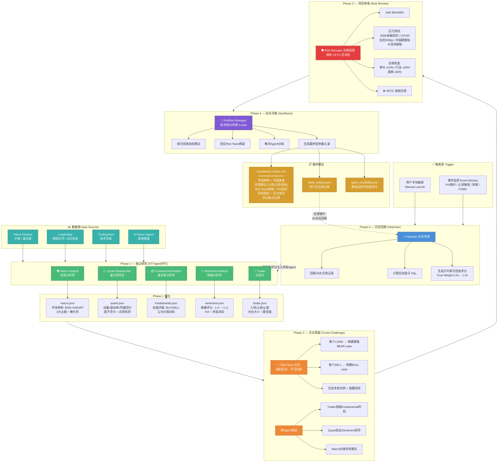
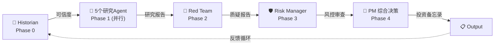
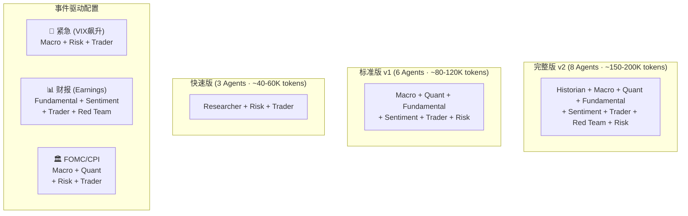
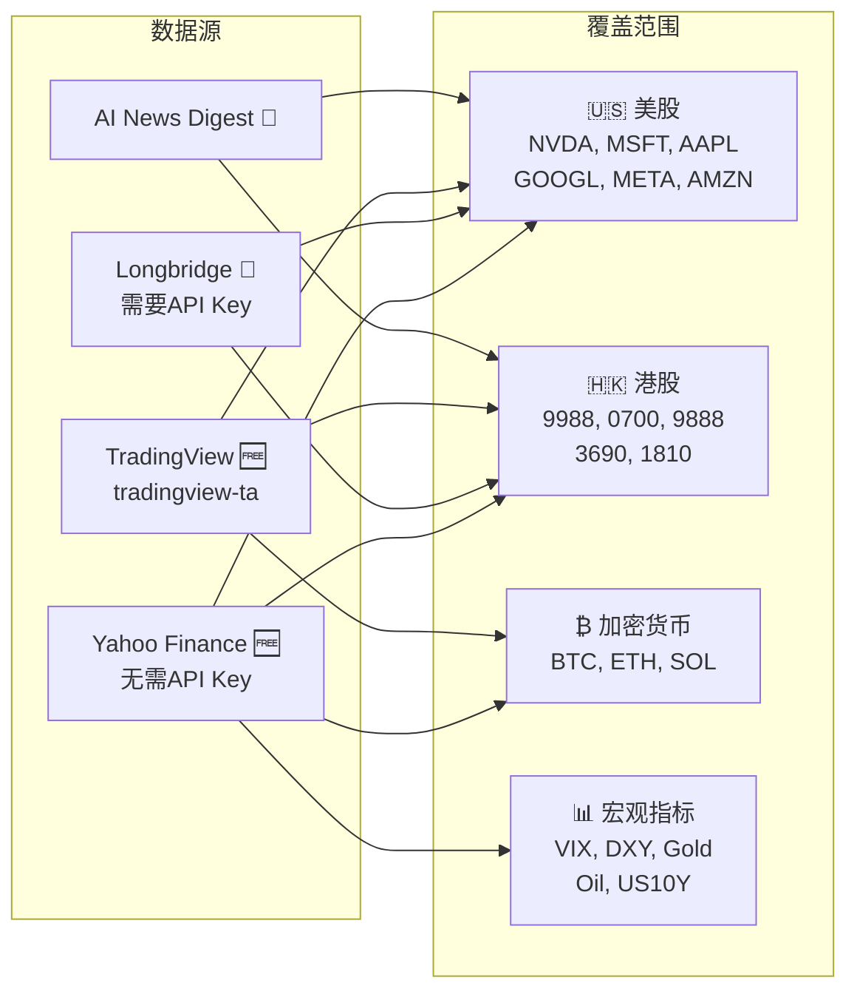

# Hedge Fund Agent Team — 工作流程示意图

## 完整工作流程 (Full Workflow)

## 简化流程图 (Simplified)

## Agent 职责速查表

| Phase | Agent | 职责 | 核心输出 |
|-------|-------|------|---------|
| 0 | Historian 历史学家 | 回顾历史交易, 计算P&L, 生成可信度评分 | `agent_credibility.json` |
| 1 | Macro Analyst 宏观分析师 | 央行政策, 收益率曲线, 通胀, 市场体制分类 | `macro.json` |
| 1 | Quant Researcher 量化研究员 | 动量因子, 波动率, 均值回归, 相关性矩阵 | `quant.json` |
| 1 | Fundamental Analyst 基本面分析师 | 财报分析, 估值模型(DCF), 行业对比 | `fundamental.json` |
| 1 | Sentiment Analyst 情绪分析师 | 新闻情绪, VIX, 资金流向, 北向资金 | `sentiment.json` |
| 1 | Trader 交易员 | 技术分析(RSI/MACD/BB), 入场/止损/止盈 | `trader.json` |
| 2 | Red Team 红队 | **强制反对**, 构建反向论点, 寻找失败先例 | `red_team.json` |
| 3 | Risk Manager 风控经理 | VaR, 压力测试, 合规检查, **否决权(VETO)** | `risk.json` |
| 4 | Portfolio Manager 组合经理 | 加权综合, 回应质疑, 最终决策 | `investment_memo.md` |

## 团队配置选项

## 数据源映射

